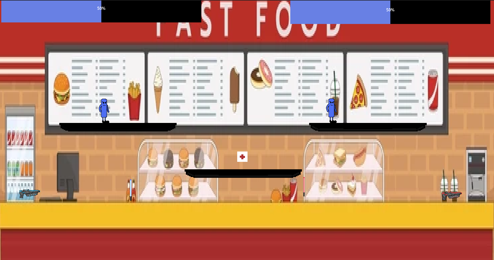

# **Fighting Game**

## **Overview**

This is a fighting game developed as part of a college project. The game features fun and engaging combat mechanics where players can control characters in a 2D environment. The game was created by a team of five members, each contributing to different aspects of development such as gameplay design, coding, and audio.

## The Game



## **How to Play**

1. **Start the game:**
    - Launch the game using the Godot Engine IDE.

2. **Objective:**
    - The goal is to defeat your opponent. You can choose from various weapons available in the game.

3. **Game Mode:**
    - Play against another player on the same keyboard.

## **Keyboard Controls**

**Player 1:**
- Move Left: `A`
- Move Right: `D`
- Jump: `W`
- Crouch: `S`
- Attack: `Space`

**Player 2:**
- Move Left: `Arrow Left`
- Move Right: `Arrow Right`
- Jump: `Arrow Up`
- Crouch: `Arrow Down`
- Attack: `Enter`

## **How to Win**

- The game ends when one player's health reaches zero.

## Installation

1. Create a folder before cloning the repository

    ```sh
    mkdir NameOfFolder
    ```
3. Go to the folder that you created

    ```sh
    cd NameOfFolder
    ```

3. Clone the repository:

    ```sh
    git clone https://github.com/arthurpvicente/Fighting-Game
    ```

4. Open Godot Engine:
    - Click in the `Import Project` or `Ctrl+I`
    - Run the project

## **Author**

- [Arthur Vicente](https://www.linkedin.com/in/arthurpvicente/)